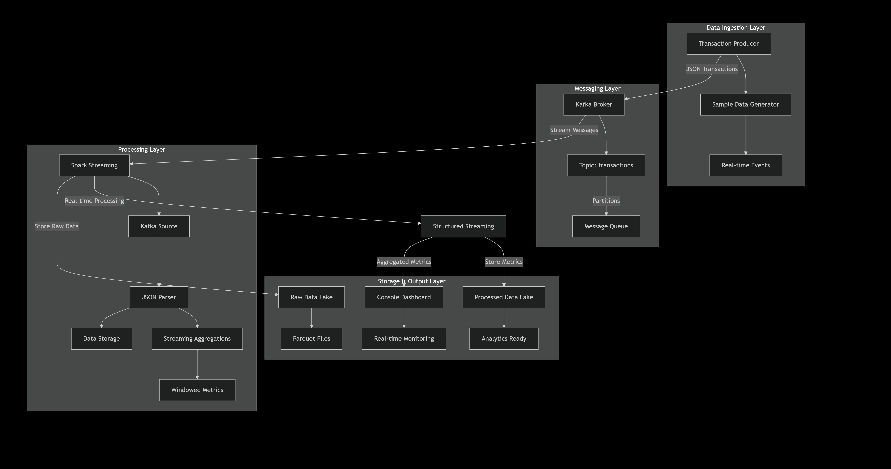

# SPARK STREAMING PLAYGROUND

A complete streaming platform built with Apache Spark, Kafka, and Python for processing  transactions with real-time dashboard and data storage.



## Prerequisites

Python 3.8+
Java 11 (recommended) or Java 17 with specific configurations
Docker and Docker Compose ( for Kafka and Zookeeper setup)

## installation
```
git clone <repository-url>
cd spark-playground
python -m venv venv
source venv/bin/activate  # On Windows: venv\Scripts\activate
pip install -r requirements.txt
```

## infrastructure
```
docker-compose up -d
```

## Generate random transactions
```
python src/data_generator.py
```


## Running the Batch Processing Application
```
python src/analytics.py
```

## Running the Streaming Application
```
python scripts/start_kafka_simulation.py
python scripts/start_streaming_analytics.py
```

## Running the Playground Analysis

```
python src/playground.py
```
## Project Structure

```
spark-playground/
├── data/                          # Generated data storage
│   ├── raw/transactions/          # Raw Kafka messages (Parquet)
│   └── processed/metrics/         # Aggregated metrics (Parquet)
|   └── transactions.json          # generated transactions samples
├── checkpoints/                   # Spark streaming checkpoints
├── scripts/
│   ├── start_kafka_producer.py          # Kafka transaction producer
│   └── start_streaming_analytics.py     # Spark streaming app
├── src/
│   ├── spark_streaming.py         # Main streaming processor
│   ├── kafka_simulator.py         # Main kafka producer
│   ├── spark_streaming.py         # Main streaming processor
│   ├── run_analytics.py           # Run Analytics batch processing over JSON transactions.
│   ├── data_generator.py          # Sample transaction generator
│   └── config.py                  # Configuration settings
│   └── playground.py              # Querying playground on spark parquet data
├── docker-compose.yml             # Kafka & Zookeeper setup
└── requirements.txt               # Python dependencies
```